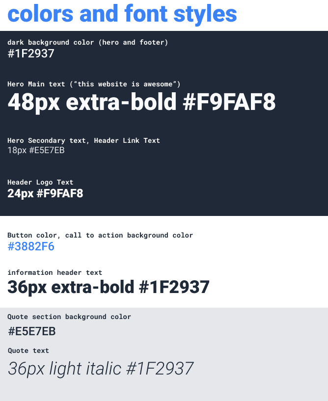

# Odin Project - Landing Page

## Description 

This project was created using HTML and CSS to make a website to a provide picture. The project had the following requirements:

* The final website should look like the following:

* Some of the details about the text and colour where also given:

The page in this repo is the result.

## Installation

The site does not require installation steps.

## Usage 

The website can be viewed at [https://bowseruk.github.io/odin-landing-page/](https://bowseruk.github.io/odin-landing-page/) with Google Chrome. The source can be viewed in Chrome by right clicking and selecting inspect.

## Credits

This site was based on a project on the [The Odin Project](https://www.theodinproject.com/).

[W3School](https://www.w3schools.com/) was used as a reference for elements to use and good practice.

The changes were checked with [W3C Validator](https://validator.w3.org/).

[Stack Overflow](https://stackoverflow.com/) always seems to have the answer to a problem that occurs.

## License

This project uses the licence in the LICENCE file of the repo.